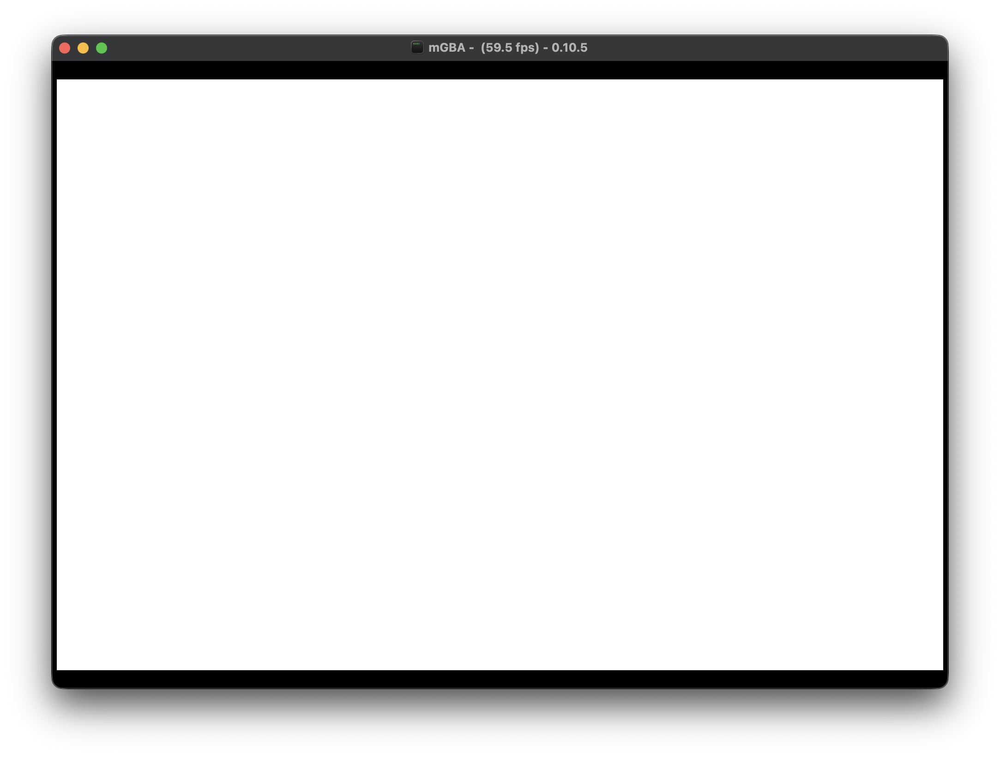
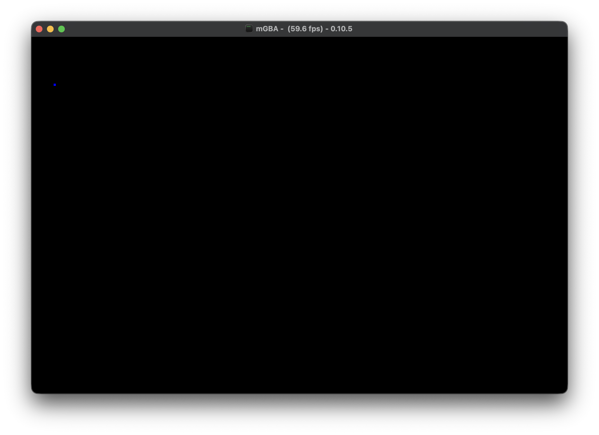
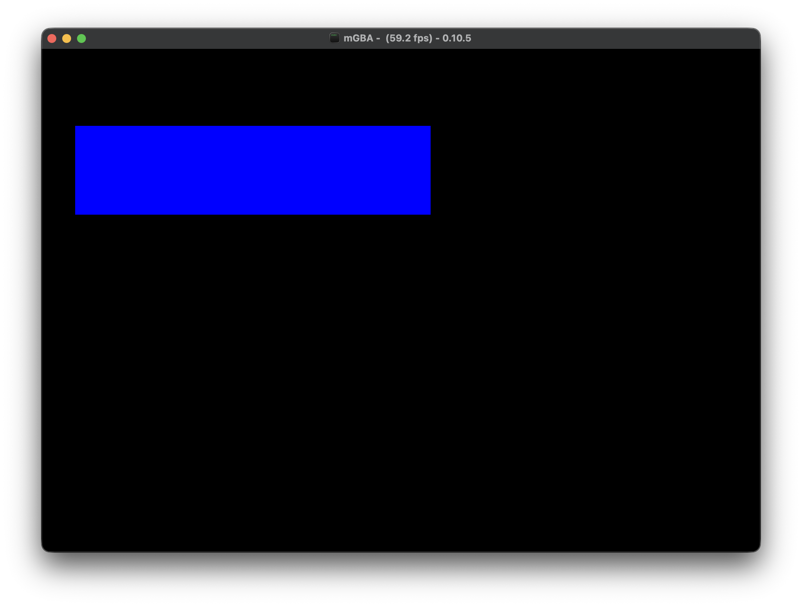

+++
title = "Rust x GBA: Setup and Pixels (Draft)"
date = "2026-05-14T15:00:00Z"
description = "A guide on how to setup a rust project that builds a basic rom which runs on the GBA"
[taxonomies]
tags = ["rust", "code", "gba", "gaming"]
+++

This post is a work in progress.

## [Background](#background) {#background}

This is the part where I tell you my life story before giving you the recipe to make "Chocolate Chip Cookies". [Click here to skip ahead.](#setup) 

Last year around this time I wanted to work on a low-level project with Rust. Most of my day job I spent building APIs in TypeScript but Rust had interested me in its ability to model program execution in a safe, performant way allowing developers to write code that performs at native speeds while still having the conveniences of a modern language.

I started out buying a couple {{ link(label="Arduino ESP32", url="https://store-usa.arduino.cc/products/nano-esp32") }} boards and did the basics, blinking lights, ESPNow Ping and Pong, etc. While fun, you also need to be good with electronics to do any useful "work" with an ESP32 and that isn't my strong suit. 

After spending some time searching, I landed on the Game Boy Advance as a fun platform to try and develop for. It has a 32-bit Arm processor, input buttons on the device, has output like a screen and speakers, MMIO (Memory Mapped Input / Output), and is standardized in the sense that what runs on one Game Boy Advance will run on any other. With all of these features it also had some tight restrictions such as limited memory, limited rom space, VRAM limitations, sprite limitations, etc.

On my mind at the time was the quote by Orson Welles:

> "The enemy of art is the absence of limitations"
> \- Orson Welles

I started out on this journey figuring out what existed in the space already. I found two crates with different goals in mind:

The first I saw was the crate {{ link(label="gba", url="https://docs.rs/gba/latest/gba/") }} which posits itself as a crate that does just enough to make a rust safe API to work with the hardware from the language.

The docs said it best:

> This crate provides an API to interact with the GBA that is safe, but with
> minimal restrictions on what components can be changed when. If you’d like
> an API where the borrow checker provides stronger control over component
> access then the {{ link(label="agb", url="https://docs.rs/agb/latest/agb/") }} crate might be what you want.

That statement sold me as I wanted low-level rust with as little hand holding as possible so I dove in to the `gba` crate.

From there I read the repo, setup a project, and followed some great tutorials from other talented developers on how to get started with GBA development.

The first tutorial I followed was {{ link(label=`Shane's dev blog - "Building GBA Games in Rust"`, url="https://shanesnover.com/2024/02/07/intro-to-rust-on-gba.html") }} which covered Shane's learning process on getting started with GBA development on Rust. Best of all was a link to his {{ link(label=`"Conway's Game of Life" repository`, url="https://github.com/ssnover/game-of-life") }} containing a functional GBA Rust project which became the building block for my gba games (and we will pull some features and code from it as we go). The blog post is worth reading as it covers GBA development at a high level while also providing a concrete example with the "Game of Life".

After this, the main tutorials that I followed was {{ link(label=`Kyle Halladay - "GBA Tutorial"`, url="https://kylehalladay.com/gba.html") }} set of blog posts which covered how to get started with GBA development in C++. From drawing on the screen to drawing a sprite, drawing background layers, user input, it was a great resource and I highly recommend you read it when you get a chance. We will cover similar topics in this tutorial in a similar order and you will find that it is a strong inspiration for the pacing and direction of this tutorial.

Another great resource which dove deep into the hardware and explained how the Game Boy Advance actually worked under the hood was {{ link(label="Tonc", url="https://www.coranac.com/tonc/text/toc.htm") }}. This was a bit harder to read as it was very technical but it contained a trove of information such as info on the underlying hardware, memory layout, quirks, tips, pointers, code examples, etc. When it came time to understanding a new system like sprites or background modes, I enjoyed reading the info on each of the modes, what you can do with them, and code examples on how to best leverage them that Tonc provided. I would recommend bookmarking that site as it has a wealth of information that will come in handy later.

This tutorial will rehash many of the things Kyle covered in his tutorials but will be focused solely on Rust and specifically the [gba](https://docs.rs/gba/latest/gba/) crate. Since we are working on an embedded system, we will only have access to `core` (you can use `alloc` also but we won't for this project) and will not have access to the traditional, expansive rust standard library.

This tutorial will cover the basics to get you up and running and future tutorials may be created that cover more advanced topics.

At the end of this tutorial you will have a rust project that builds a functional GBA rom that you can use as a foundation for your own games.

## [Setting Up Your Dev Environment](#setup) {#setup}

#### Rust

There are a few prerequisites before we get started.

You will need to have Rust / Cargo installed on your machine. We will be using a nightly version of the compiler. If you have a recent version of Rust / Cargo installed it should download the nightly version you need when we configure the project later on (thanks `rust-toolchain.toml`).

If you don't have Rust installed, you can use {{ link(label="RustUp", url="https://rustup.rs/") }} to get your machine setup.

#### Other Software

Next we will follow the instructions from the {{ link(label="gba", url="https://docs.rs/gba/latest/gba/#how-to-make-your-own-gba-project-using-this-crate") }} crate on how to setup our own gba project. There are a few things we need to download and setup here but it is just a one time setup.

##### ARM Binutils

First we will need to download the {{ link(label="ARM Binutils", url="https://developer.arm.com/Tools%20and%20Software/GNU%20Toolchain") }}.

> You'll need the ARM version of the GNU binutils in your path, specifically the linker (`arm-none-eabi-ld`).
> Linux folks can use the package manager. Mac and Windows folks can use the [ARM Website](https://developer.arm.com/Tools%20and%20Software/GNU%20Toolchain)

##### GBA Emulator

Lastly we will need an emulator to run our game. According to the `gba` crate, the roms created by the crate can be run on devices directly but require extra steps that won't be covered in this tutorial.

We will be using the {{ link(label="mGBA emulator", url="https://mgba.io/downloads.html") }} as it is the recommended emulator by the crate authors.

## [Project Creation (automatic)](#project-creation-auto) {#project-creation-auto}

The following section of the tutorial covers setting up the rust project with the proper configuration.

If you want to skip manual file creation, you can clone a starter copy of this project using the command below:

```shell
git clone -b starter https://github.com/undecidedapollo/gba-tutorial.git
```

After cloning, you may need to edit your `.cargo/config.toml` to point to your `mGBA` emulator downloaded above, it is different for each Operating System.

Once cloned you should be able to run `cargo run` and it will start `mGBA` and show a blank, white screen.

[Click here to skip ahead to "Doing Something"](#doing-something)

## [Project Creation (manual)](#project-creation-manual) {#project-creation-manual}

With everything installed we can use `cargo` to create a new `binary` project which we will use as the foundation for building our GBA game.

```shell
cargo new --bin gba-tutorial
```

We can now `cd gba-tutorial` into our project and begin setting it up for GBA development.

#### Nightly Rust

GBA development with rust requires us to use the nightly compiler. To tell rust to always use the nightly compiler for our project we start by setting up a `rust-toolchain.toml` file in the root of our project.


```toml
[toolchain]
channel = "nightly"
components = ["rust-src"]
```

If you are like me and like to pin your versions, you can specify a specific nightly version here instead like so:

```toml
[toolchain]
channel = "nightly-2026-05-09"
components = ["rust-src"]
```


#### Cargo Config

First, we need to tell cargo more about this project and how to build it. We start by creating a directory called `.cargo` and creating a file inside of it called `config.toml` (full path: `.cargo/config.toml`). Inside of the file we set a few options:

```toml
[build]
target = "thumbv4t-none-eabi" # Specify the cpu / system architecture we are targeting

[unstable]
build-std = ["core"] # Specify we only want core

[target.thumbv4t-none-eabi]

# NOTE: you may need to update this for your own operating system
runner = "mgba-qt" # sets the emulator to run bins/examples with
# Mac:
# runner = "/Applications/mGBA.app/Contents/MacOS/mGBA"

rustflags = [
  "-Clinker=arm-none-eabi-ld", # uses the ARM linker
  "-Clink-arg=-Tlinker.ld", # sets the link script
]
```

#### Download Linker Script

We need a link script to tell the linker how to properly structure our executable. Thankfully the `gba` crate authors provide us with one.

{{ link(label="Linker File", url="https://github.com/rust-console/gba/blob/main/linker_scripts/mono_boot.ld") }}

Download or copy the file and save it to `linker.ld` inside of your project.

#### Add the GBA Crate

Add the gba crate to the project, we will use version 0.15 which is the latest at the time this tutorial was written.

You can use cargo to add the crate:

```shell
cargo add gba@0.15
```

At the end, your `Cargo.toml` should look like the following:

```toml
[package]
name = "gba-tutorial"
version = "0.1.0"
edition = "2024"

[dependencies]
gba = "0.15"
```

#### Create Our First Executable

Lastly, we can copy a modified version of the starter function definition from the `gba` crate documentation which sets up a `no-std` compatible executable file. It is barebones and won't do anything, but we will be able to run it.

Update your existing `src/main.rs` file (created above with `cargo new`) to have the following contents:

```rust
#![no_std]
#![no_main]

use gba::prelude::*;

#[panic_handler]
fn panic_handler(_: &core::panic::PanicInfo) -> ! {
    loop {}
}

#[unsafe(no_mangle)]
extern "C" fn main() -> ! {
    loop {}
}

```

#### (Optional) VSCode Configuration

If you are using rust-analyzer inside VSCode, you may notice it giving you warnings from the above code changes. Since we are building a rom that doesn't use std and uses a custom architecture we need to tell VSCode about it. To do so, create a folder called `.vscode` and create a file named `settings.json` and put the following (full path: `.vscode/settings.json`):

```json
{
    "rust-analyzer.cargo.target": "thumbv4t-none-eabi",
    "rust-analyzer.cargo.buildScripts.overrideCommand": [
        "cargo", "check", "--target", "thumbv4t-none-eabi",
        "-Z", "build-std=core,alloc",
        "--message-format=json"
    ],
    "rust-analyzer.check.overrideCommand": [
        "cargo", "check", "--target", "thumbv4t-none-eabi",
        "-Z", "build-std=core,alloc",
        "--message-format=json"
    ],
    "rust-analyzer.check.allTargets": false,
    "rust-analyzer.cargo.extraEnv": {
        "RUSTFLAGS": "-Clink-arg=-Tlinker.ld"
    }
}
```


#### Run our ROM (first time)

At this point we can run our rom!

```shell
cargo run --release
```

While it doesn't do anything but display a white screen, it does show that we can build a rust program into a Game Boy Advance ROM.



## [Doing Something](#doing-something) {#doing-something}

Now that we have a functioning starter project, let's try to get something on the screen of the Game Boy.

### Game Boy Advance Video Background

The Game Boy Advance has a 240 (horizontal) by 160 (vertical) color screen which can be driven by a variety of video modes. Each video mode offers a different combination of features for how you can control the screen. The Game Boy has a few different features we can leverage to show things on the screen.

#### High-level feature overview:

**Background Features**

- **Bitmap Backgrounds** Control individual pixels on the screen, slow
- **Text Background** Traditional tile based layouts, tiles are 8x8 groups of pixels which can be placed on the screen in a grid format.
- **Affine Background** Advanced backgrounds similar to tile based layouts but you can perform operations on the background as a whole, such as zoom, rotation, and shear.

**Foreground Features**

- **Objects / Sprites** 128 sprite objects that you can control and move around on the screen. By default 8x8 but size can be changed. Optional affine transformations on a per-obj basis with zoom, rotation, and shear.



For more information on how data is drawn to the screen and video modes, check out:

{{ link(label=`Tonc's "Introduction to GBA Graphics".`, url="https://www.coranac.com/tonc/text/video.htm") }}

{{ link(label=`GBA Video Modes`, url="https://www.patater.com/gbaguy/gba/ch5.htm") }}


### Draw a pixel on the screen

We are going to use video mode 3 as it allows us to write direct pixel data to VRAM and have it display on the screen. While bitmap is the most versatile way to display pixels on the screen, it is slow and time consuming for the CPU to draw every pixel on the screen. We will use it to get started then switch to using tiles / objects later on.

First, we tell the {{ link(label=`DISPCNT (DisplayControl)`, url="https://docs.rs/gba/0.15.0/gba/video/struct.DisplayControl.html") }} that we want to use Video Mode 3 and to turn on background 2 (there are four backgrounds, Video Mode 3 uses background 2 to show the bitmap).


You can read more about bitmap modes at:

{{ link(label=`Tonc's "The Bitmap modes (mode 3, 4, 5)"`, url="https://www.coranac.com/tonc/text/bitmaps.htm") }}


Next we will draw a single, blue pixel on the screen at column=10, row = 20 (x=10, y=20)

```rust,hl_lines=3-7 9
#[unsafe(no_mangle)]
extern "C" fn main() -> ! {
    DISPCNT.write(
        DisplayControl::new()
            .with_video_mode(VideoMode::_3)
            .with_show_bg2(true),
    );

    VIDEO3_VRAM.get(10, 20).unwrap().write(Color::BLUE);

    loop {}
}
```

If you run this you should see a small blue dot on a black screen:

```shell
cargo run --release
```



### Lets draw more!

Drawing a pixel is fun, but we can go a step further. Let's draw a box!

We will add a nested `for` loop to our main and get it to draw a large rectangle.

```rust,hl_lines=1-9
    let start_col = 10;
    let start_row = 20;
    let end_col = start_col + 120;
    let end_row = start_row + 30;
    for row in start_row..end_row {
        for col in start_col..end_col {
            VIDEO3_VRAM.get(col, row).unwrap().write(Color::BLUE);
        }
    }
```

After running the ROM:

```shell
cargo run --release
```

> *A large, blue, horizontal rectangle enters the chat*



### Drawing Over Time

Drawing on the GBA doesn't have to happen all at once. The screen on the Game Boy updates at 60 frames per second (fps) and in between those frames we can make as many changes as we'd like to the screen and it will draw the changes on the next frame.

Instead of a loop where we start all at once, we will draw a new pixel each frame to the screen and watch as it updates the screen each frame.

First, we will need to instruct the Game Boy to notify us when a VBlank occurs. A VBlank is the moment after the graphics unit has finished drawing the screen and gives us a moment to modify the screen parameters / Video RAM without it interfering with the display. 


You can read more about VBlank at:

{{ link(label=`Tonc`, url="https://www.coranac.com/tonc/text/video.htm") }}


To do so we will have to wire up a few new things to tell it that we are interested in knowing when a VBlank occurs. Start by replacing our `main.rs` with the following:

```rust,hl_lines=13-15 24
#![no_std]
#![no_main]

use gba::prelude::*;

#[panic_handler]
fn panic_handler(_: &core::panic::PanicInfo) -> ! {
    loop {}
}

#[unsafe(no_mangle)]
extern "C" fn main() -> ! {
    DISPSTAT.write(DisplayStatus::new().with_irq_vblank(true));
    IE.write(IrqBits::VBLANK);
    IME.write(true);

    DISPCNT.write(
        DisplayControl::new()
            .with_video_mode(VideoMode::_3)
            .with_show_bg2(true),
    );

    loop {
        VBlankIntrWait();
    }
}
```

Next we will update the `fn main()` loop to keep track of where we are drawing and to draw one pixel per VBlank:

```rust,hl_lines=1-2 4-5 9-17
    const SCREEN_WIDTH: usize = 240;
    const SCREEN_HEIGHT: usize = 160;

    let mut col = 0;
    let mut row = 0;

    loop {
        VBlankIntrWait();
        VIDEO3_VRAM.get(col, row).unwrap().write(Color::BLUE);
        col += 1;
        if col >= SCREEN_WIDTH {
            col = 0;
            row += 1;
        }
        if row >= SCREEN_HEIGHT {
            row = 0;
        }
    }
```

Running this we will see the screen slowly start to fill with blue. 60 frames per second is a lot but doing one pixel at a time at a width of 240 pixels it takes exactly 4 seconds per line, for all 160 vertical lines you would have to wait over 10 minutes for the whole screen to fill up.

{{ video(src="assets/blue_line.mp4", alt="A blue dot slowly fills in the screen, starting from the top-left and working its way across row-by-row") }}


## [Wrap Up](#wrap-up) {#wrap-up}

With that we have built a Rust program that compiles to a Game Boy Advance ROM which can draw to the screen. In future tutorials we will cover how to use other background modes, how to draw objects / sprites to the screen, and how to get input from the user.

In the meantime I highly recommend reading {{ link(label=`Kyle Halladay - "GBA Tutorial"`, url="https://kylehalladay.com/gba.html") }} as he covers these topics in C++. Many of the code examples you can bring over to Rust with some minor translation.

Also take a look at the docs for the {{ link(label="gba", url="https://docs.rs/gba/latest/gba/") }} crate, there is a lot of useful information inside. The {{ link(label="repo", url="https://github.com/rust-console/gba") }} also has an `/examples` folder which shows you how to do various things on the gba (note, you may have to make some updates since we are using the 2024 edition of Rust).
